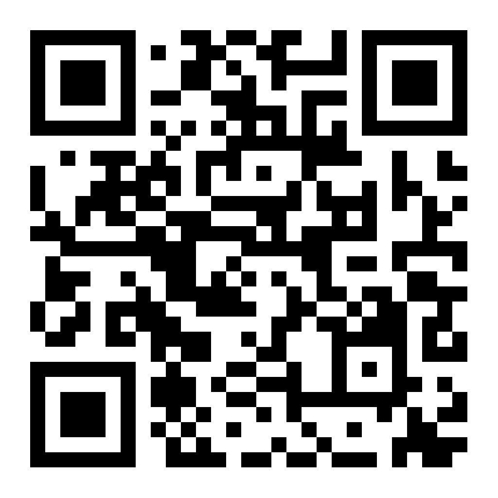

# mindfulness-slip-log-

I designed this web application to track my mindfulness lapses as a part of my occupational therapy. The app runs entirely in your web browser. It does not use a database, it does not connect to any external APIs, and your data never leaves your device. The idea is for me to use it for a month or 3 and look at my slip patterns. I you choose to you can install it on your phone like an app (instructions below). 

https://amranbuilds.github.io/mindfulness-slip-log/

## Features
* **Secure Storage:** Saves all entries directly to your phone or computer's local browser storage.
* **Quick Entry:** Use the floating button to quickly log a focus slip.
* **Native Dictation:** Use your phone's built-in keyboard microphone to securely speak your entries.
* **Dashboard Analytics:** View your slips by day, week, month, or year with simple visual charts.
* **Category Filtering:** Sort your data by specific types of distractions.

## Data Collected (On your device only; I do not get any of your data)
Each entry tracks:
1. **Date:** When it happened.
2. **Slip Category:** What kind of slip it was (Speaking, Reading, Listening, Task Focus, Memory, Other).
3. **Situation:** The context of what you were doing.
4. **Consequences:** What happened as a result.

## How to Install on Your Phone (Not required to run; you can just run it in your browser)
This is a Progressive Web App (PWA). You can save it to your home screen like a normal app.

**For iPhone (Safari):**
1. Open the website link in Safari.
2. Tap the "Share" button at the bottom of the screen (the square with an arrow pointing up).
3. Scroll down and tap "Add to Home Screen".
4. Tap "Add".

**For Android (Chrome):**
1. Open the website link in Chrome.
2. Tap the three-dot menu icon in the top right corner.
3. Tap "Add to Home Screen" or "Install App".
4. Follow the on-screen prompt to add it.

## License
This project is open source and available under the MIT License.

**AI Disclosure:** This project was outlined and coded with the assistance of artificial intelligence. My programming skills are not at the level where I can do this all by meyslef. 

## Credits
* Application icon designed and illustrated by Jennifer Leigh (@jennigma). https://www.jennigma.net/

## Lessons Learned

* **Progressive Web App (PWA) Caching:** Mobile browsers aggressively cache PWA files to save bandwidth. Deploying and testing code updates requires manually clearing site-specific data or using private browsing to bypass outdated scripts.
* **iOS Icon Standards:** A standard `manifest.json` file is insufficient for Apple devices. An explicit `<link rel="apple-touch-icon" href="icon.png">` tag must be included in the HTML head for custom icons to render on an iOS home screen.
* **Timezone Data Filtering:** Relying on default browser date parsing (UTC) causes local time discrepancies, making same-day entries disappear. Date filtering logic must strictly extract and compare string values (YYYY-MM-DD) to function accurately in the local timezone.
* **UI Scaling Constraints:** Unbounded lists break mobile layouts as data accumulates. A CSS `max-height` boundary paired with `overflow-y: auto` is required to manage growing raw data logs without pushing the primary dashboard off-screen.
* **AI Code Auditing:** AI-assisted development requires strict auditing of scope boundaries. Misplacing or deleting a single closing bracket `}` in JavaScript functions or CSS rules results in complete execution failure.

